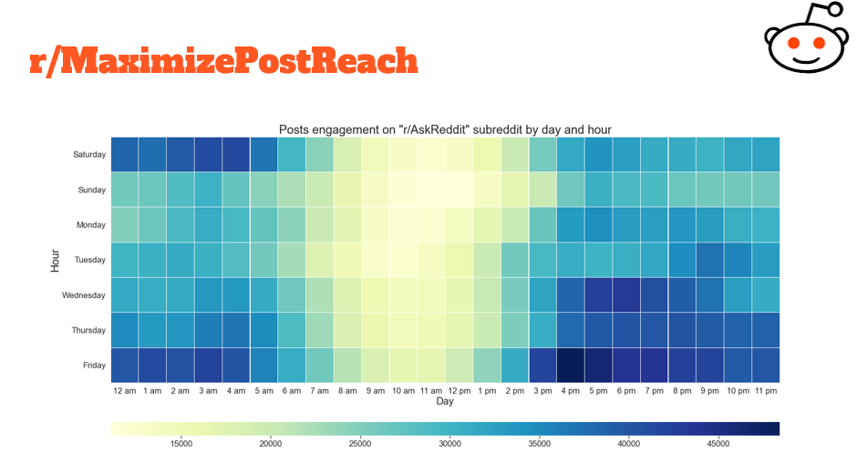

# Analyzing 53 million Reddit comments using Hadoop map-reduce

This project was required for [us](#authors) as a part of the "Big Data Analytics" course that we studied at University of Science and Technology, Zewail City (Mini Project 1 - Hadoop Ecosystem).
## Dataset
The Dataset consists of a list of comments taken for the Reddit public API from various subreddits. 
- The dataset is one file with each comment in JSON format in one line
- Total Comments: 53,851,542 
- Compression Type: bzip2 (5,452,413,560 bytes compressed | 31,648,374,104 bytes uncompressed) 
- Dataset can be found [here](https://drive.google.com/file/d/1-D_uHkn37M5ptWVQl8a5-q8NBv9jaLWr/view?usp=sharing) 
- Do NOT open the dataset file on an editor as it may cause a crash or a freeze to your application or your system 
- You can explore/generate your own samples using these commands

    Windows (Powershell): 

       $ gc <file_name> | select -first <line_number> >> sample.out

    Linux: 
    
       $ head -n <line_number> <file_name> >> sample.out

## Data Inspection and Data Analysis
The details are mentioned in the Report.pdf document.
## MapReduce Jobs

    1. The top subreddits.

    2. The most popular topics in top subreddits.

    3. The topics that yield the highest number of upvotes.

    4. The top users in top subreddits.

    5. The posts reach on top subreddits by day and hour.
    
A heatmap showing the posts engagement on "r/AskReddit" subreddit:

## How to run a job?

Each job is placed in a folder where a script specific to this job is available to run
it and pass the necessary parameters to the mapper and reducer. If a task requires
two jobs to produce the final output, then the script will run the first job and then
feed its output to the second job.
## Using the compressed dataset

To use the compressed the dataset we edited the file HADOOP HOME/etc/hadoop/core-
site.xml to add the bzip2 codec. The jobs were running with the compressed dataset
used as input without any problems. However, later we discovered that we did not
need to modify anything for Hadoop to read from a bzip2 file, and we did give a try
by removing the bzip2 codec from the core-site.xml and once again the jobs were
able to run with the compressed dataset as input without any problems.
## References

We used code snippets from the below to achieve certain functionalities in our jobs.

- [Unix sort descending order](https://stackoverflow.com/questions/11957845/unix-sort-descending-order)

- [Top n values by hadoop mapreduce](https://stackoverflow.com/questions/20583211/top-n-values-by-hadoop-map-reduce-code)
## Authors

- [Fatma Moanes](https://github.com/Fatma-Moanes)
- [Mohamed Elshaffei](https://github.com/mo-shaffei)

## Credits
Special Thanks to Dr. Elsayed Hemayed, Eng. Ahmed Sameh Elsayed, and Eng. Muhammad AlAref.
